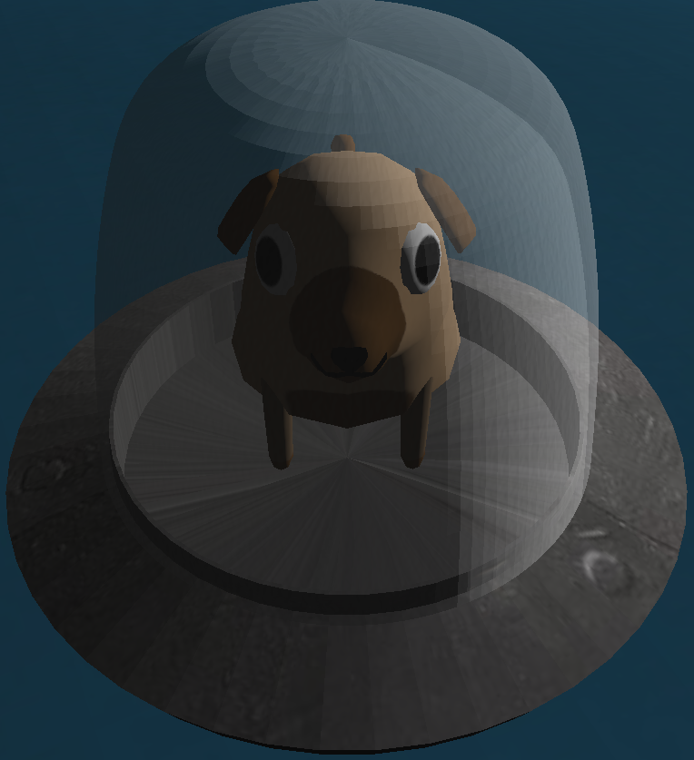
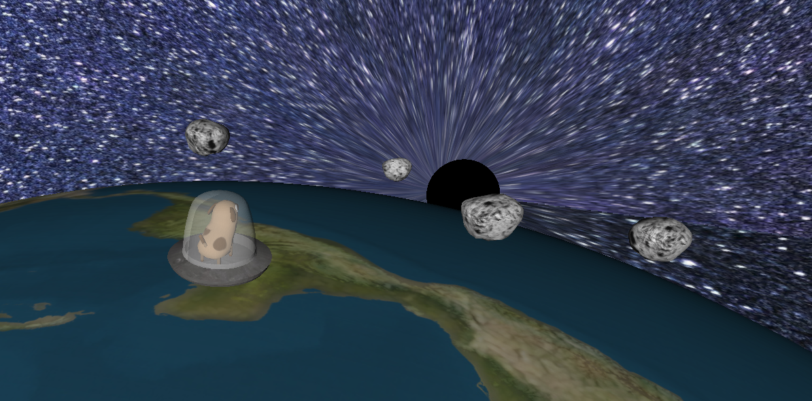
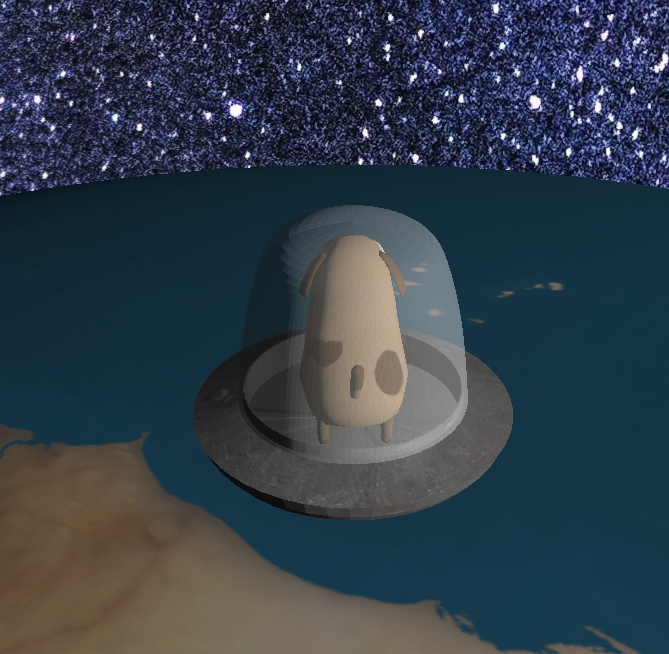
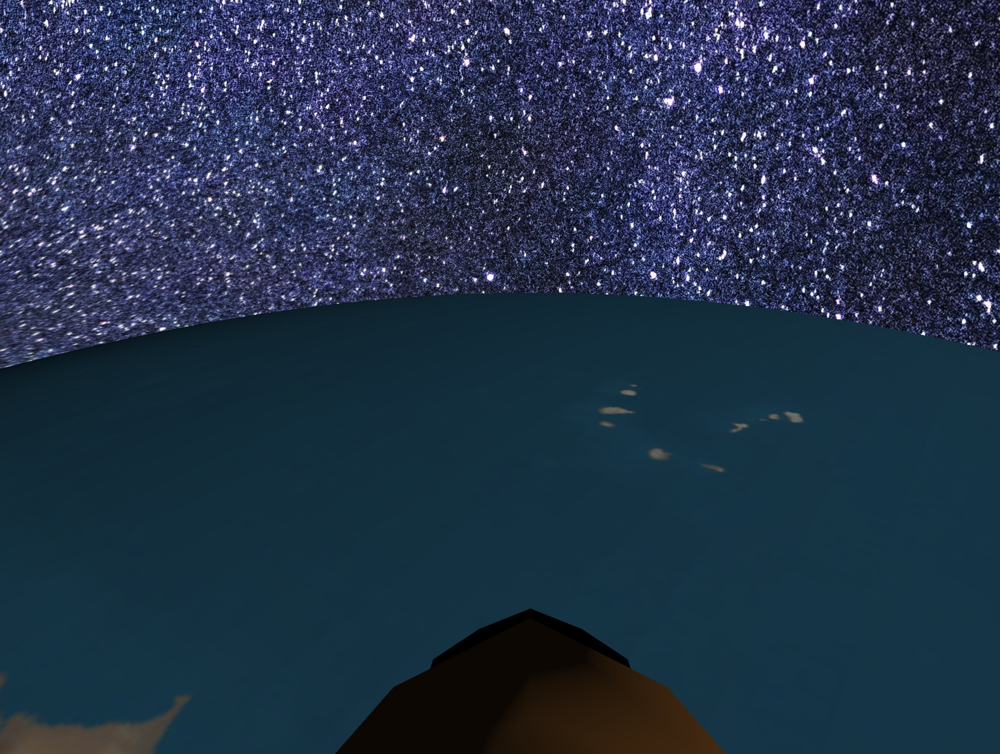

# Trabalho Final FCG - Space Dog

  

## Objetivo do jogo
O objetivo do jogo é fazer com que o cachorro (modelo principal) destrua todos dos asteróides que estão vindo em direção a terra. Quando o cachorro e sua nave espacial colidirem com os asteróides, eles são destruídos.

  

## Integrantes
- Carlos Zukov Gatti
- Gabriel Moncks Guarda

## Divisão de tarefas
Gabriel: Implementação das colisões, câmera em primeira pessoa, asteróides (tanto os modelos quanto a randomização deles), funcionamento de texturas, curva de bézier.

Carlos: Modelos (cachorro, terra, nave, céu, vidro, etc), implementação da rotação (movimentação do cachorro), iluminação (todos os modelos), curvas de bézier, funcionamentos de textura e colisões.

## Utilização de ferramentas de IA
Fizemos o uso do ChatGPT em alguns momentos, principalmente para entender o funcionamento de algumas funções e parâmetros que deveriam ser passados para elas. Além disso, utilizamos o Copilot para implementações simples, como a velocidade do cachorro. Acreditamos que em casos assim a IA se torna uma ferramenta extremamente útil, já que minimiza o trabalho de busca em documentações e
facilita o entendimento de funções simples (como a da acelaração de um cachorro em relação ao tempo) para agilizar o processo.

## Descrição do processo de desenvolvimento
O primeiro passo do desenvolvimento (após pensar na ideia do jogo), foi implementar a movimentação do cachorro. Tivemos a (infortuna) ideia de implementar a rotação da seguinte forma: o cachorro
permanece o jogo inteiro fixo na mesma posição e a terra que rota embaixo dele (Ex: para simular que o cachorro está se movendo para frente, a terra rota no sentido contrário no qual o cachorro rotaria).
Após, implementamos o mapeamento de textura dos modelos (cachorro, nave espacial, vidro, skybox) e implementação da iluminação (o cachorro possui o modelo de iluminação difusa de Lambert, o sol possui
o modelo de interpolação de iluminação de Gouraud e todos os outros objetos possuem o modelo de iluminação de Blinn-Phong e modelo de interpolação de iluminação de Phong). Então, implementamos a segunda
câmera e os asteróides (o fato do cachorro ser fixo e o resto girar complicou isso imensamente). Junto dos asteróides, fizemos as colisões e a animação baseada em curva de bézier.

  

## Manual de uso da aplicação
O cachorro se move sobre a terra usando as teclas WASD (onde 'W' se move para a frente, 'A' se move para a direita, 'D' se move para a esquerda e 'S' se move para baixo), ainda assim é possível
movimentar a câmera utilizando o mouse. Além disso, pode-se trocar a perspectiva da câmera para "primeira pessoa" apertando a tecla 'C', diminuir ou aumentar o zoom usando o "scroll" do mouse e apertando 'ESC' para sair da aplicação.

  

  

